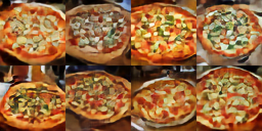
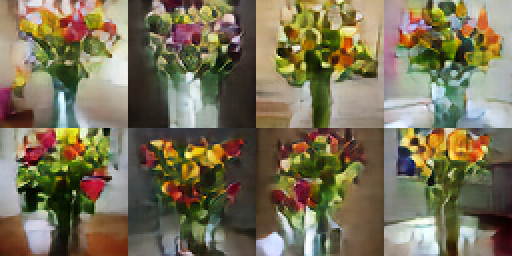
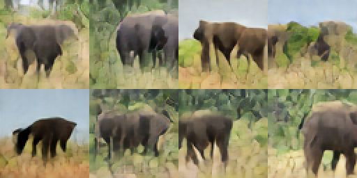
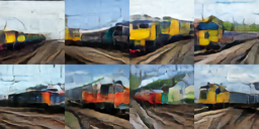
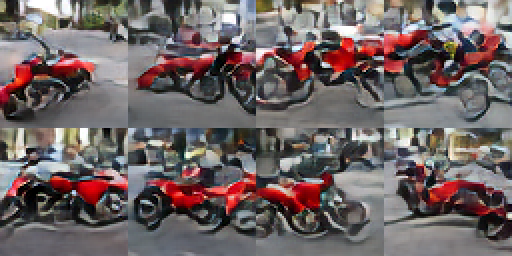
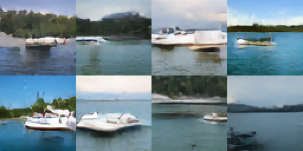
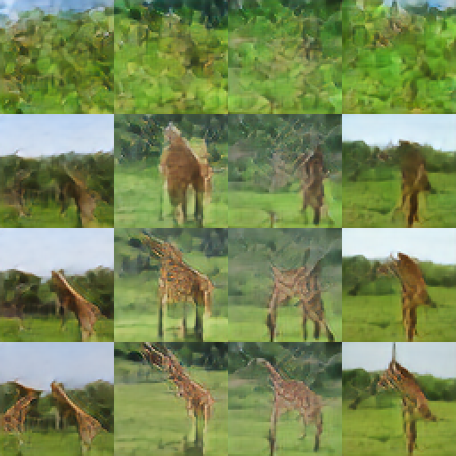
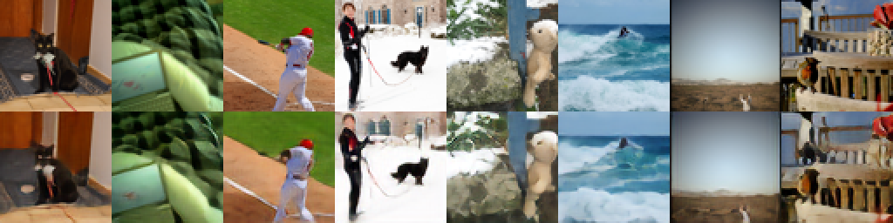

# Latent Diffusion from Scratch

A complete text-to-image latent diffusion model — VAE, UNet, CLIP text conditioning, DDIM
sampler — written from first principles in ~1,700 lines of PyTorch, with no `diffusers`,
no `transformers`, and no pretrained weights beyond a frozen CLIP text encoder.

Trained on COCO 2017 at 64×64 on a **MacBook Air M2 with 8 GB of RAM**.

<p align="center">
  
  
</p>
<p align="center">
  <em>“a pizza on a wooden table” &nbsp;·&nbsp; “a vase of flowers on a table”</em>
</p>

---

## Results

<table>
<tr>
<td width="50%"></td>
<td width="50%"></td>
</tr>
<tr>
<td align="center"><em>“an elephant walking through tall grass”</em></td>
<td align="center"><em>“a train travelling along the railway tracks”</em></td>
</tr>
<tr>
<td></td>
<td></td>
</tr>
<tr>
<td align="center"><em>“a red motorcycle parked on a city street”</em></td>
<td align="center"><em>“a small white boat on a calm lake”</em></td>
</tr>
<tr>
<td></td>
<td></td>
</tr>
<tr>
<td align="center"><em>“a beautiful sunset at the beach”</em></td>
<td align="center"><em>“a foggy magical forest”</em></td>
</tr>
</table>


## How it learns

The same prompt and the same noise seed, at 2k / 18k / 56k / 134k training steps:

<p align="center"></p>

Green mush → a vague quadruped → a giraffe shape → patterned giraffes with legs and necks.

## The autoencoder

Everything the diffusion model can produce is capped by how well the VAE reconstructs.
Top row real, bottom row reconstructed from a 4×16×16 latent — a **12× compression**:

<p align="center"></p>

---

## Architecture

| Component | Params | Role |
|---|---:|---|
| **VAE** | 4.97 M | 3×64×64 ⟷ 4×16×16 latent (12× compression) |
| **UNet** | 31.62 M | denoiser, cross-attends to the caption |
| **CLIP ViT-B/32 text** | 63.17 M | frozen, pretrained — the only borrowed weights |
| **PatchGAN critic** | 0.66 M | VAE training only, discarded afterwards |

**Stage 1 — VAE.** `L1 + LPIPS + 1e-6·KL + adaptive PatchGAN hinge`, the
Esser et al. 2021 / Rombach et al. 2022 objective. L1 rather than L2 because L2's optimum
under uncertainty is the average of plausible textures, which is literally a blur.

**Stage 2 — diffusion.** v-prediction with **zero terminal SNR** (Lin et al. 2024) on a
cosine schedule (Nichol & Dhariwal 2021), **min-SNR-γ** loss weighting (Hang et al. 2023),
cross-attention on frozen CLIP (Rombach et al. 2022), 10% caption dropout for
classifier-free guidance, sampled with **DDIM** (Song et al. 2020) at guidance 5.0 with
the guidance rescale of Lin et al. 2024.

Data is **streamed**: every step fetches its own images, encodes them and tokenises their
captions, keeping nothing. Memory is O(batch), not O(dataset) — the loop is unchanged
whether the corpus is 118k images or a hundred million.

## Numbers

| | |
|---|---|
| Dataset | COCO train2017 — 118,225 images @ 64×64, 581,125 captions, 2,000 held out |
| VAE | held-out **LPIPS 0.018**, PSNR 25.9 dB, 9 epochs (~4 h) |
| Diffusion | **134,000 steps** @ batch 64 ≈ 74 passes over the data (~37 h) |
| Validation loss | 0.5963 (2k) → **0.5377** (134k) |
| Hardware | Apple M2, 8 GB unified memory, MPS backend |
| Peak RAM | ~0.2 GB during diffusion training |

## Usage

```bash
python dataset.py        # build the 64×64 image cache (streams from COCO, ~1.5 GB)
python train_vae.py      # stage 1: the autoencoder
python train.py          # stage 2: the latent diffusion model
```

Generate from a prompt:

```bash
python generate.py "a small white boat on a calm lake"
python generate.py "a red bus on a city street" 7.0     # ... at guidance 7
```

Each module self-tests when run directly — `python diffusion.py` verifies the
v-prediction round-trip and that terminal `alpha_bar` is exactly zero; `python model.py`
checks shapes and zero-initialisation.

## Files

```
dataset.py     COCO download + 64×64 cache
model.py       VAE, UNet, PatchGAN critic
clip_text.py   CLIP text encoder + BPE tokeniser, written out
lpips.py       LPIPS perceptual distance, from AlexNet features
diffusion.py   noise schedule, v-prediction, min-SNR, DDIM — no networks
train_vae.py   stage 1
train.py       stage 2
generate.py    inference
```

## Honest limitations

Single-subject, texture-dominated prompts work well — pizza, flowers, elephants, boats.
**Multi-object spatial scenes do not**: bathrooms and crowded tables get the palette and
object density right but not the arrangement. Faces never resolve; at 64×64 a face is
about ten pixels across.

This is a **capacity and data limit, not a training-time limit**. Validation loss was
still falling at 134k steps, but the last 40,000 steps bought 0.0024 and a barely visible
change. For comparison, DiT-S/2 is the same size as this UNet (33 M) and reaches FID 68
on the easier task of class-conditional ImageNet after 400k steps — while Stable Diffusion
v1 used a 860 M UNet on ~2 billion image-text pairs. 118k images is a small corpus for
generative modelling, and COCO's cluttered everyday scenes are a harder target than the
canonical web imagery most text-to-image models are trained on.

## References

Rombach et al. 2022 (*Latent Diffusion*) · Esser et al. 2021 (*Taming Transformers*) ·
Ho et al. 2020 (*DDPM*) · Song et al. 2020 (*DDIM*) · Nichol & Dhariwal 2021 ·
Lin et al. 2024 (*zero terminal SNR*) · Hang et al. 2023 (*min-SNR-γ*) ·
Ho & Salimans 2022 (*classifier-free guidance*) · Zhang et al. 2018 (*LPIPS*) ·
Radford et al. 2021 (*CLIP*)
